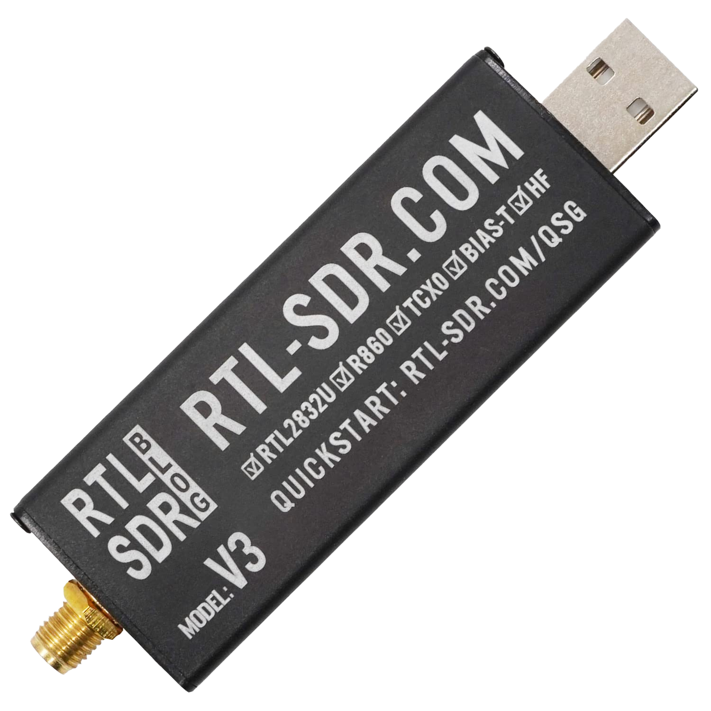
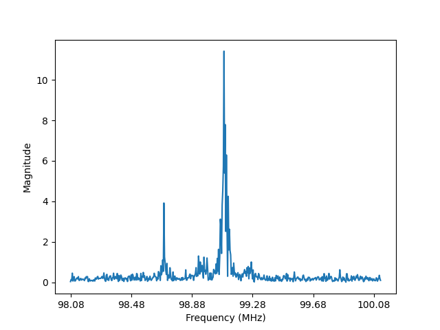

<h1 title>Introduction</h1>

## Software Defined Radio Workshop

<!--
We use radio technology like FM radio, Bluetooth, Wi-Fi, and Cellular daily, but how do they actually work?
In this workshop you will learn some of how these systems work and implement your own simplified versions.
-->

---

# What is Software Defined Radio

<div two-column>
<div>

- A radio system where components that were traditionally implemented with analog hardware are implemented with software
- SDR as a thing is a device that receives and digitizes RF data for processing on a computer
- Building blocks of wireless communication protocols like Wi-Fi (QAM), Bluetooth (FSK), and Cellular (QAM)

</div>
<div style="width: 70%;margin-left: 20px;">



</div>
</div>

<!--
- QAM → Quadrature Amplitude Modulation
- FSK → Frequency Shift Keying
-->

---

# RTL2832

<div two-column>
<div>

- Integrated circuit produced by Realtek Corporation
- Demodulates DVB-T (Digital Video Broadcasting – Terrestrial) signals
- Has an additional mode for receiving FM radio

<br />

- While working on a driver for the Linux kernel, *Eric Fry* realized that the FM radio mode could be used to capture raw IQ samples

</div>
<div style="width: 70%">


</div>
</div>

---

# RTL-SDR

<div two-column>
<div>

- rtl-sdr is a software package that includes the librtlsdr library and various command line tools

- librtlsdr lets you configure the tuner and receive IQ samples in your own programs

- There are bindings to librtlsdr in many languages, including Python

</div>
<div style="width: 100%;margin-left: 20px;">

```python
from rtlsdr import RtlSdr

sdr = RtlSdr()
sdr.sample_rate = 2.048e6
sdr.center_freq = 100e6
sdr.freq_correction = 60
sdr.gain = 'auto'

samples = sdr.read_samples(1024)
sdr.close()
```

> Example program using the `pyrtlsdr` Python package

</div>
</div>

---

# Setting up your Environment

- Open the [resources page](https://connorcode.com/files/Documents/sdr-workshop) for this workshop on Google Classroom
- *Plug in your RTL-SDR device* and go through the steps in the setup guide

<hr/>

1. Install *Python* and *Visual Studio Code* from the Microsoft Store
1. Download setup files linked on Google Classroom
1. Run Zadig to fix the USB drivers
   - Select RTL-SDR device, then click "Reinstall Driver"
1. Run `example.py` to make sure everything is working

---

<div two-column>
<div>

# Example Program Output


- If everything worked, you should see a frequency spectrum like the one here
- I'm transmitting FM audio data at 100Mhz, so that's what the signal is

</div>
<div style="width: 80%;margin-left: 15px;">

</img>

</div>
</div>
