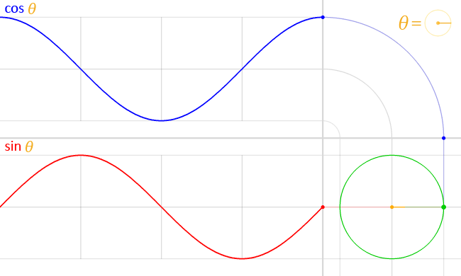
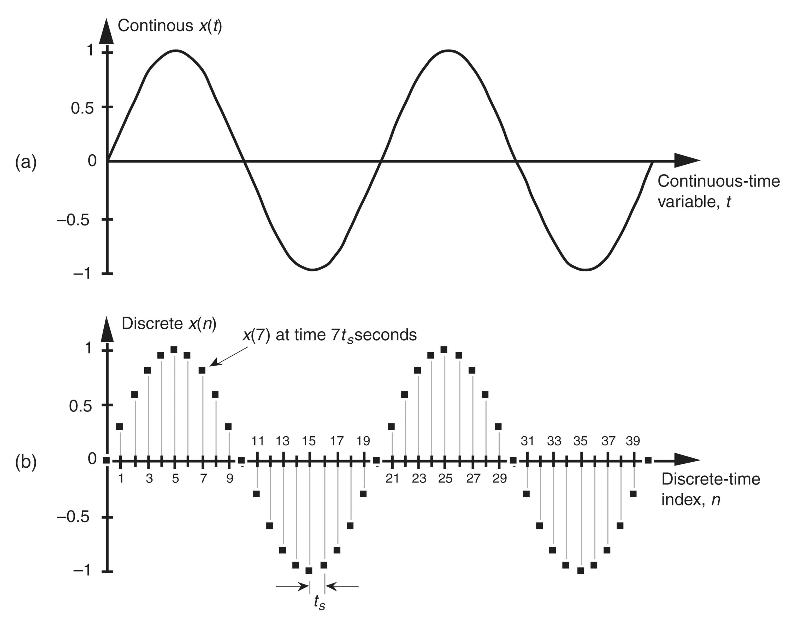
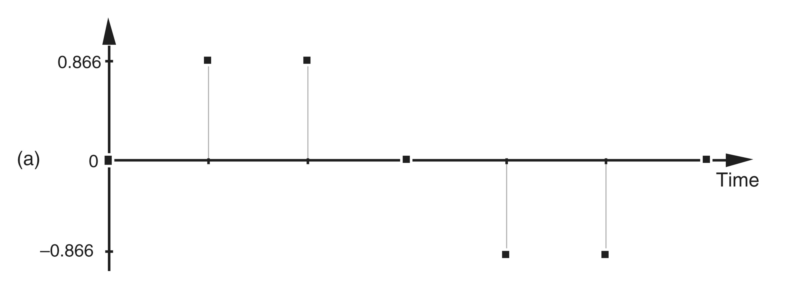
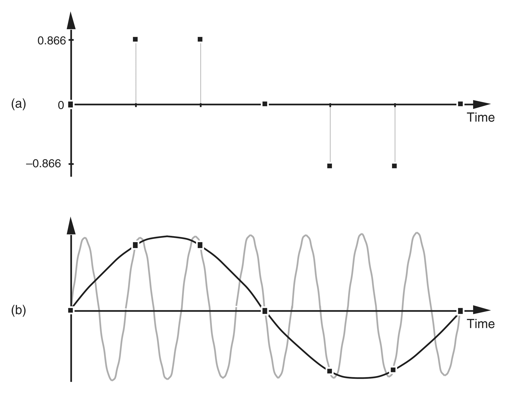
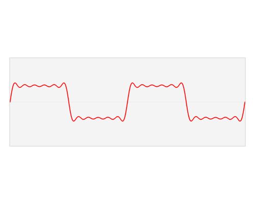

<h1 title>Digital Signals</h1>

## Software Defined Radio Workshop

---

# Radians

- A unit for angle based on the radius of a circle
- Often easier to work with mathematically
- Approximately $57.2958^\circ{}$

 

|Degrees|$0^\circ{}$|$90^\circ{}$|$180^\circ{}$|$270^\circ{}$|$360^\circ{}$|
|:-:|:-:|:-:|:-:|:-:|:-:|
|Radians|$0$|$\pi/2$|$\pi$|$3\pi{}/2$|$2\pi{}$|

<!--
R=(a*pi)/180
-->

---

# Sine Waves

- $f(t)=a\sin(2\pi{}ft+p)$
  - Amplitude: $a$
  - Frequency: $f$
  - Phase Shift: $p$
- $\cos(t) = \sin(t + \frac{\pi}{2})$
- $\cos(t)=\cos(-t)$

<!--
sin(x)=-sin(-x)
-->

---

# What is a Signal?

- In order to digitally process a signal, an Analog to Digital Converter (ADC) is used

- We can configure an ADC with a sample rate (number of samples per second) and obtain a series of discrete values

---

# What Signal Could these Samples Represent?

---

# Ambiguity in the Frequency Domain :scream:

- Discrete-time samples have a frequency ambiguity that does not exist for continuous signals

- A series of discrete-time samples can represent *infinitely many* continuous signals

- This phenomenon is known as *aliasing*

---

# Aliasing

- The blue plots show the true signal and its frequency

- The orange plots show a signal reconstructed from the discrete samples

<!--
Upper left: Animation depicts a sequence of sinusoids, each with a higher frequency than the previous ones.
These "true" signals are also being sampled (blue dots) at a constant frequency/rate, Upper right: The continuous Fourier transform of the sinusoid (not the samples).
The single non-zero component, depicting the actual frequency, means there is no ambiguity. Lower right: The discrete Fourier transform of just the available samples.
The presence of two components means the samples can fit at least two different sinusoids, one of which is the true frequency (upper-right).
Lower left: Using the same samples (now in orange), the default reconstruction algorithm produces the lower-frequency sinusoid.
-->

---

# The Nyquist–Shannon Sampling Theorem

If a function $x(t)$ contains no frequencies higher than $B$ hertz, then it can be completely determined from its ordinates at a sequence of points spaced less than $\frac{1}{2B}$ seconds apart.

- The Nyquist Sampling Theorem states that your sample rate must be at least double the highest frequency in the sample to avoid aliasing

<!--
Human hearing is approx 20Hz to 20,000 Hz

- 44,100 Hz - CD audio (most common)
- 48,000 Hz - Standard sample rate for professional applications
-->

---

# The Frequency Domain

- Usually we think of signals in the *time domain*, where their value is changing through time
- All signals can be represented with an infinite sum of sine waves with varying frequency, amplitude, and phases
- A function or signal can be converted between the time and frequency domains with the *Fourier transform*

---

# Time-Frequency Properties

- Time-Frequency Properties or 'Fourier properties' tell us how the frequency domain signal is affected by certain modifications to time domain signal
- There are more properties than what is covered here

1. Linearity
1. Frequency Shift
1. Scaling in Time

<!--
Additional properties:

- Convolution in Time Property
- Convolution in Frequency Property
-->

---

# Time-Frequency Properties: Linearity

- If we add two signals in the time domain, the two frequency domain signals will also be added together.
- If either of the time domain signals are scaled by a scalar, the frequency domain signal will also scaled by the same amount.

 

$$
\boxed{ax(t)+bx(t) \leftrightarrow aX(f)+bY(f)}
$$

---

# Time-Frequency Properties: Frequency Shift

- By multiplying a time domain signal by a complex sinusoid at frequency $f_0$, we shift it by $f_0$ in the frequency domain
- This is how the tuner in the RTL-SDR is able to change the center frequency, it also allows us to focus in on specific parts of the spectrum in software

 

$$
\boxed{e^{i2\pi{}f_0t}x(t) \leftrightarrow X(f-f_0)}
$$

---

# Time-Frequency Properties: Scaling in Time

- Scaling in the time domain causes an inverse scaling in the frequency domain
- This means that if we want to transfer data at a faster rate, we have to use physically more of the bandwidth

 

$$
\boxed{x(at) \leftrightarrow X(\frac{f}{a} \times \frac{1}{\lvert a \rvert})}
$$
