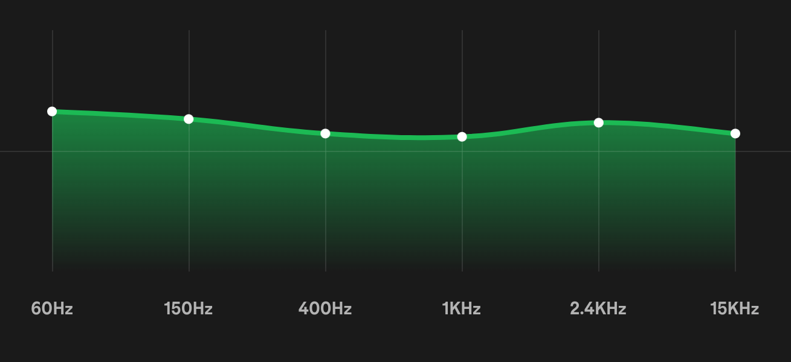

<h1 title>Digital Signals</h1>

## Software Defined Radio Workshop

---

# Radians

- A unit for angle based on the radius of a circle
- Often easier to work with mathematically
- Approximately $57.2958^\circ{}$

 

|Degrees|$0^\circ{}$|$90^\circ{}$|$180^\circ{}$|$270^\circ{}$|$360^\circ{}$|
|:-:|:-:|:-:|:-:|:-:|:-:|
|Radians|$0$|$\pi/2$|$\pi$|$3\pi{}/2$|$2\pi{}$|

<!--
R=(a*pi)/180
-->

---

# Sine and Cosine

- As we move a point around the perimeter of a unit circle where its angle with the positive x axis is $\theta{}$
  - $\theta$ ranges from $0$ to $2\pi$
  - $\cos{\theta}$ is its $x$ coordinate
  - $\sin{\theta}$ is its $y$ coordinate

---

# Sine Properties

- $f(t)=a\sin(2\pi{}ft+p)$
  - Amplitude: $a$
  - Frequency: $f$
  - Phase Shift: $p$
- $\cos(x) = \sin(x + \frac{\pi}{2})$
- $\cos(x)=\cos(-x)$

<video src="assets/digital-signals/sine-wave.mp4" autoplay loop controls muted width="100%"></video>

<!--
sin(x)=-sin(-x)
-->

---

# Sampling

- In order to digitally process a signal, an Analog to Digital Converter (ADC) is used

- We can configure an ADC with a sample rate (number of samples per second) and obtain a series of discrete values

---

# What Signal Could These Samples Represent?

---

# Ambiguity in the Frequency Domain :scream:

- Discrete-time samples have a frequency ambiguity that does not exist for continuous signals

- A series of discrete-time samples can represent *infinitely many* continuous signals

- This phenomenon is known as *aliasing*

---

# Aliasing

- The blue plots show the true signal and its frequency

- The orange plots show a signal reconstructed from the discrete samples

<!--
Upper left: Animation depicts a sequence of sinusoids, each with a higher frequency than the previous ones.
These "true" signals are also being sampled (blue dots) at a constant frequency/rate, Upper right: The continuous Fourier transform of the sinusoid (not the samples).
The single non-zero component, depicting the actual frequency, means there is no ambiguity. Lower right: The discrete Fourier transform of just the available samples.
The presence of two components means the samples can fit at least two different sinusoids, one of which is the true frequency (upper-right).
Lower left: Using the same samples (now in orange), the default reconstruction algorithm produces the lower-frequency sinusoid.
-->

---

# The Nyquist Sampling Theorem

- Your sample rate must be at least double the highest frequency in the sample to avoid aliasing
- If you sample at some sample rate, the highest frequency you can reconstruct will be half that sample rate

<!--
Human hearing is approx 20Hz to 20,000 Hz

- 44,100 Hz - CD audio (most common)
- 48,000 Hz - Standard sample rate for professional applications
-->

---

# Fourier Series

- A Fourier series is the series of sine waves summed to reconstruct a signal
- Sometimes you need an infinite number of terms for an *exact solution*

<video src="assets/digital-signals/fourier-series.mp4" autoplay loop controls muted width="80%"></video>

<!-- 
Every signal has a fourier series!
-->

---

# The Frequency Domain

- Usually we think of signals in the *time domain*, where their value is changing through time
- All signals can be represented as a sum of sine waves with varying frequency, amplitude, and phases
- Some operations are very difficult to do in the time domain but much easier in the frequency domain

---

# Visualizing the Frequency Domain

- You have interacted with the frequency domain already through audio visualizers and equalizers

</img>
</img>

<!--
The equalizer is from Spotify® settings.
-->

---

# Spectrograms

- Shows the frequency domain of a signal over time
- Most of you saw this last week through SDR++

<!--  -->

- Making spectrograms will be our first project!

<video src="assets/digital-signals/waterfall.mp4" autoplay loop controls muted width="100%" style="border-radius: 6px"></video>

