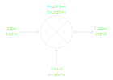
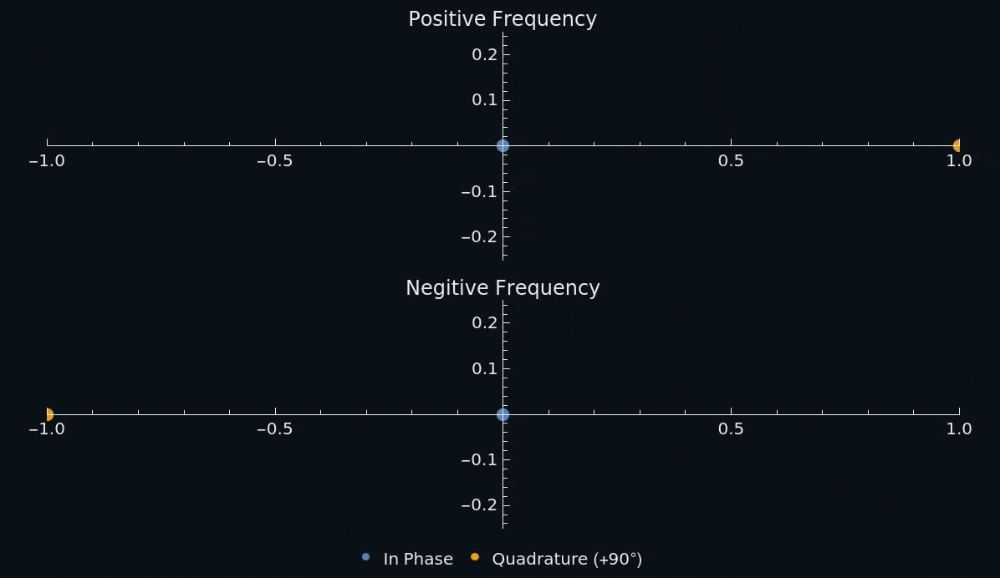
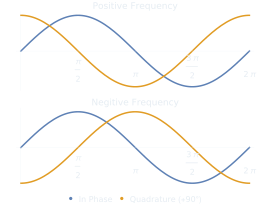
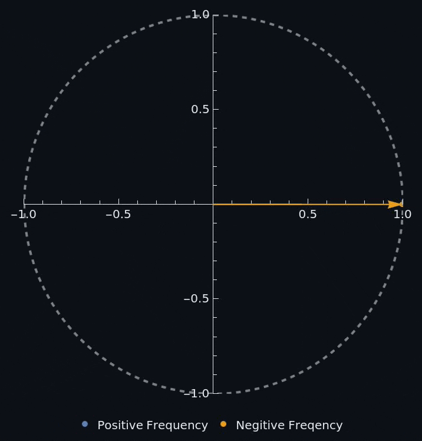
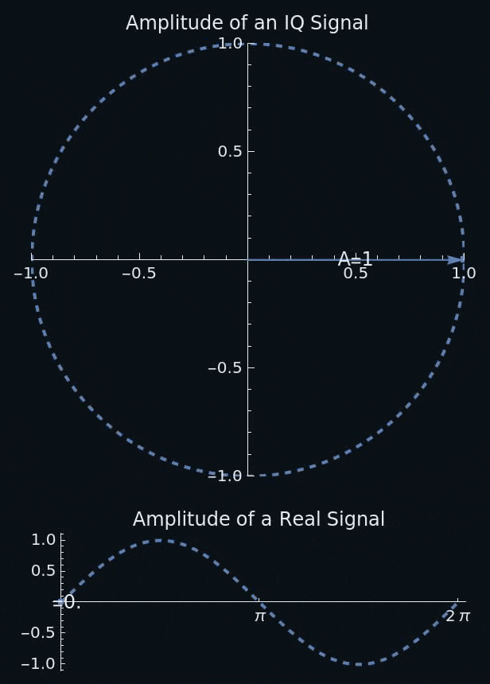
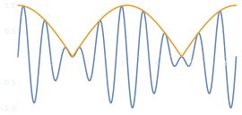
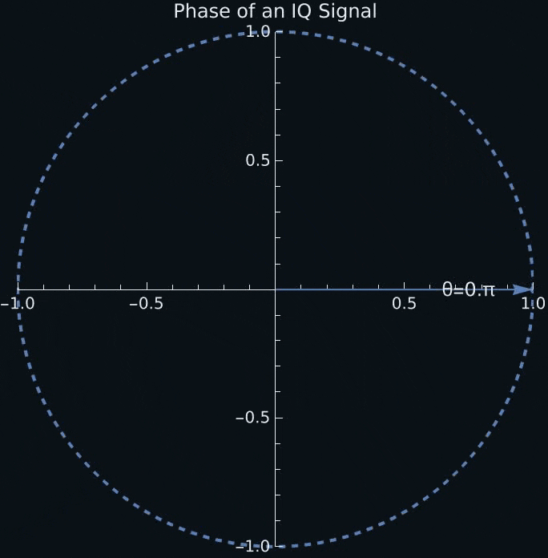

<h1 title>IQ Sampling
</h1>

## Software Defined Radio Workshop

---

# Limited Sample Rates

- Most RTL-SDRs can sample at about 2.4 MHz max
  - Due to the *Nyquist Sampling Theorem*, only frequencies below 1.2 MHz can be recovered (This is not even enough for FM radio!)
- Because DACs have limited sample rates, we need to *shift* the signal in the frequency domain into the sampleable range

<!-- 
It would be impractical to sample at higher rates due to limited data transfer rates, among other reasons

- HackRf can do 20 MHz
- FM radio in america: from 88.0 to 108.0 MHz
-->

---

# Mixing Signals

- A *mixer* is a device that combines two input signals to produce an output signal with frequencies equal to the sum and difference of the input frequencies
- In software, we just need to multiply the samples of each signal
- See [Interactive Signal Mixing](https://files.connorcode.com/Documents/sdr-workshop/interactive/signal-mixing/index.html)

---

# Another Frequency Ambiguity

- Internally SDRs use a local oscillator (LO) and a mixer to shift incoming RF (radio frequency) signals to *baseband*
- Unfortunately when the RF is shifted down, some frequencies become negative, which appear the same as positive signals

---

</img>

<!-- 
The blue dot shows the signal itself (inphase) and the orange shows it 90° out of phase (quadrature).

The quadrature view gives us more info on the signal, if it leads the blue its positive and if it lags behind its negative.
-->

---

# IQ Sampling

- By separately mixing our signal with the LO and the LO with a 90° phase shift we have enough information to distinguish positive and negative frequencies
- IQ stands for In-phase and quadrature
  - Here quadrature just means two waves 90° out of phase

</img>

---

# Hardware Implementation of the Tuner

---

# Phaser Diagrams

- Because we have two values, I and Q, we can plot them on a 2D plane
- Positive frequencies rotate counter-clockwise and negative frequencies rotate clockwise

---

# The Power of Quadrature Sampling

- Although we are using IQ sampling out of necessity to handle negative frequencies, *analytic signals* (the continuous version of IQ sampling) are commonly used in mathematical analysis
- Analytic signals have instantaneous amplitude and phase

---

## Instantaneous Amplitude

- With a real signal it's hard to determine the *power* (envelope) of a signal
  - You can only really measure it at the peak of the signal ($\frac{\pi}{2}$, $\frac{3\pi}{2}$, etc.)
  - You probably didn't sample the exact peak
- We can measure the magnitude (amplitude) of any IQ sample

---

### Envelope

- The envelope of a signal is calculated as the magnitude of its IQ samples

 

</img>

---

## Instantaneous Phase

- There's no easy way to get the instantaneous phase from a real signal
  - Other that converting it into an analytical signal at least
- The instantaneous change in phase is the angular frequency ($\omega=2\pi{}f$)

---

# IQ Samples as Complex Numbers

- IQ samples are often represented a *complex numbers*
  - The in-phase component is real and the quadrature component is imaginary ($I+Qi$)
- Complex operations
  - Absolute value is its magnitude (distance from the origin)
  - Argument is the angle it makes with the positive real axis $[0,\pi{}]$
  - Addition adds the real and imaginary components
  - Multiplication adds the magnitudes and arguments
