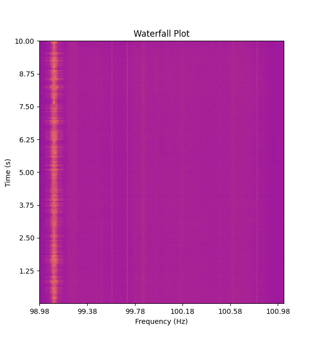
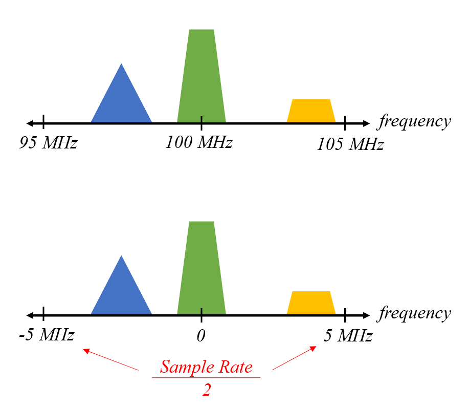
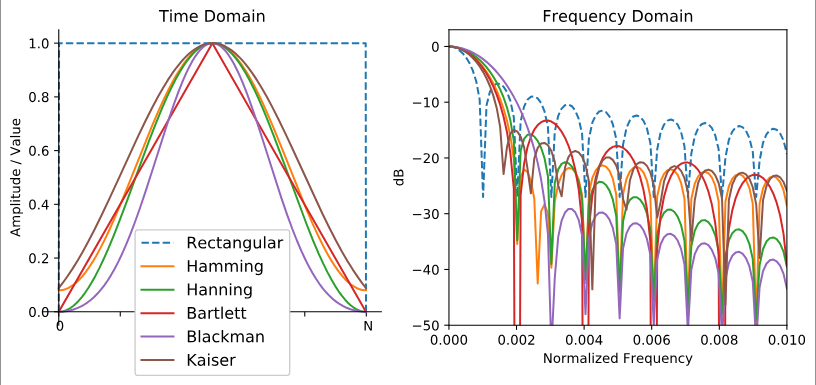
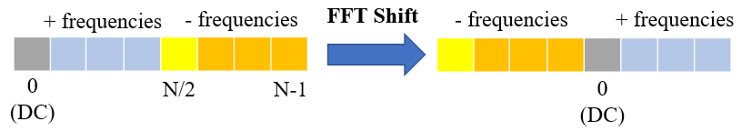
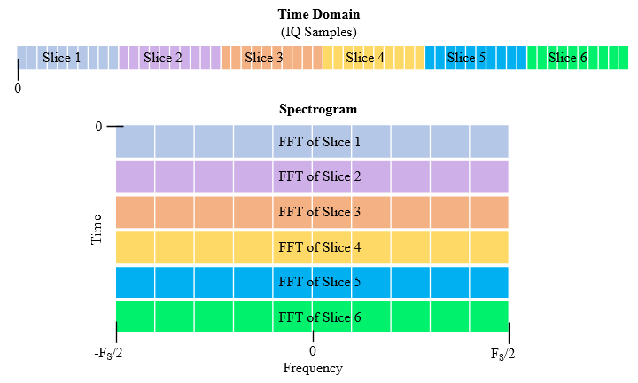

<h1 title>Spectrogram Project</h1>

## Software Defined Radio Workshop

---

<div two-column>
<div style="transform: translateY(25%);">

# Project Summary

We will be writing a Python program that records and plots the RF spectrum over time.

</div>
<div style="width: 90%;margin-left: 10px">



</div>
</div>

---

# The Fourier Transform

<div two-column>
<div>

- Operation that converts a time-domain signal to the frequency-domain
- When working with discrete-time signals, we use a discrete Fourier transform (DFT)
- A fast Fourier transform (FFT) is an efficient algorithm for computing the DFT
- Complex values are used with FTs (instead of just real values) to represent the phase shifts

</div>
<div style="width: 60%;margin-left: 30px;">

$$
\hat{f}(\xi)=\int^{\infin}_{-\infin}f(x)e^{-i2\pi\xi x}dx\\[3mm]
\Downarrow\\[3mm]
X_k=\sum_{n=0}^{N-1}x_ne^{-i2\pi{}\frac{k}{N}n}
$$

</div>
</div>

<!--
Because of how the FFT is implemented, it's best to use some power of 2 number of samples as input.

$$
\hat{f}(\xi)=\int^{\infin}_{-\infin}f(x)e^{-i2\pi\xi x}dx
$$

e^ix = cos(x) + i*sin(x)
-->

---

# DFT Properties

- The size of the frequency domain output is the same as time domain input
  - More samples results in a higher resolution in the frequency domain
  - Each bin corresponds to $f_s/N\text{ Hz}$
- Increasing the sample rate gives us a greater frequency range in the output
  - The output range is $-f_s/2$ to $f_s/2$
  - This makes sense if you think back to the Nyquist Sampling Theorem

<br />

> $f_s$ is the sample rate.

<!--
When givin a completely real time-domain input, the frequency-domain output's positive and negative segments will be identical in magnitude,
the negative frequencies will be complex conjugates of the positive frequency components.
-->

---

# Negative Frequency???

<div two-column>
<div>

- Negative frequency does not exist physically, it's just a mathematical construct
- It's effectively just a frequency relative to our defined center frequency
- If we tune to 100 MHz with a sample rate of 10 MHz, we will view the spectrum from 95 MHz to 105 MHz

</div>
<div style="width: 70%;margin-left: 30px;">



</div>
</div>

---

# Windowing

- FTs assume that the time-domain input signals are periodic, meaning the last sample connects back to the first
- Sharp jumps between samples cause lots of unwanted frequency artifacts
- To avoid jumps, we use *windowing functions* to taper our signal to zero at the ends

<div center>

</div>

---

# Introduction to `pyrtlsdr`

- PyRTL-SDR is used to initialize the SDR at startup then read samples
- The first ~2000 samples should be ignored

```python
sdr = RtlSdr() # Connect to RTL-SDR device
sdr.sample_rate = 250_000 # 250 kHz
sdr.center_freq = 200_000_000 # 200 MHz
sdr.gain = 'auto'
```

```python
# Ignore first 2048 samples
sdr.read_samples(2048)

while True:
  # Read 1024 IQ samples from the device
  samples = sdr.read_samples(1024)
```

---

# Introduction to `numpy`

- Each chunk of samples needs to be processed quickly or the program won't run in real time (Python on its own is not fast enough!)
- Numpy allows efficiently performing operations on large datasets

<br>

```python
array = np.array([1, 2, 3]) # Convert a Python List to a Numpy Array
```

---

# Array Operations with `numpy`

- Basic operations like `+`, `-`, `*`, and `/` can be performed *element-wise* on same sized arrays
- Many mathematical functions are available like `np.hamming`, `np.fft.fft`, `np.fft.fftshift`, `np.abs`

<br>

```python
a = np.array([1., 2., 3.])
b = np.array([4., 5., 6.])

a + b # [5., 7., 9.]
np.mean(a) # 2.0
```

---

# FFT in Python

```python
FFT_SIZE = 1024

# Read in some samples (they are complex,
# we will get to why in the next section)
samples = sdr.read_samples(FFT_SIZE) * np.hamming(FFT_SIZE)

# Use numpy to perform a FFT, transforming
# our signal into the frequency domain.
fft = np.fft.fftshift(np.fft.fft(samples))

# Get the magnitude of each frequency
# component, ignoring phase shifts.
freq = np.abs(fft)
```

<!--
Note that the discarding of ~2048 samples has been omitted from this example.

What is the frequency range and bin width of the freq array:

- center_freq - f_s/2 = 98.08
- center_freq + f_s/2 = 100.12

- f_s/fft_size = 4000 Hz
-->

---

# What is `np.fft.fftshift`?

- Due to *math reasons*, the output of a Fourier Transform starts with the DC component, the positive frequencies, then the negative ones
- We usually want negative frequencies on the left, DC in the middle, and positive frequencies on the right
- This function just shifts the array around into the desired format

<div center>



</div>

---

# Spectrograms

<div two-column>
<div>

- A spectrogram is a plot that shows a signal's frequency over time
- This is achieved by splitting the incoming samples into chunks and stacking their frequency domain representations
- A color map is used to display the magnitude of each frequency

</div>
<div style="width: 110%">



</div>
</div>

<!--
Also known as a waterfall plot
-->

---

# Spectrogram in Python

- After we build up a list of FFT results, we need to show it as a 2D image
- For this we can use the `plt.imshow` function from `matplotlib`
  - Setting the `aspect` to 'auto' let it scale the image to fill the window

<br>

```python
waterfall = []
for _ in range(512):
  samples = sdr.read_samples(FFT_SIZE) * np.hanning(FFT_SIZE)
  fft = np.abs(np.fft.fftshift(np.fft.fft(samples)))
  waterfall.append(fft)

plt.imshow(waterfall, aspect='auto', cmap='plasma')
plt.show()
```

---

# Fixing the Axes

- By default `imshow` will just show the number of pixels on each axis
- We can define functions that take in the x and y coordinates and return nicer labels

```python
def x_tick_formatter(x, pos): pass
def y_tick_formatter(y, pos): pass

fig, ax = plt.subplots()
ax.set_xlabel('Frequency (Hz)')
ax.set_ylabel('Time (s)')
ax.xaxis.set_major_formatter(mticker.FuncFormatter(x_tick_formatter))
ax.yaxis.set_major_formatter(mticker.FuncFormatter(y_tick_formatter))
```

---

# Python String Formatting

- F-strings or formatted strings allow you to create a string with values from variables or expressions added in
- Extra arguments can be passed to limit the number of digits after the decimal

<br>

```python
a = 'world'
b = 3.14159

f'Hello, {a}'  # => 'Hello, world!'
f'π ≈ {b}'     # => 'π ≈ 3.14159'
f'π ≈ {b:.2f}' # => 'π ≈ 3.14'
```
