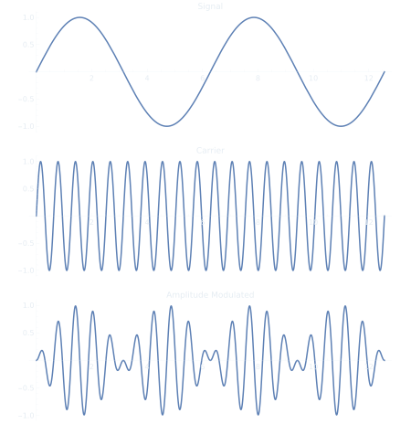
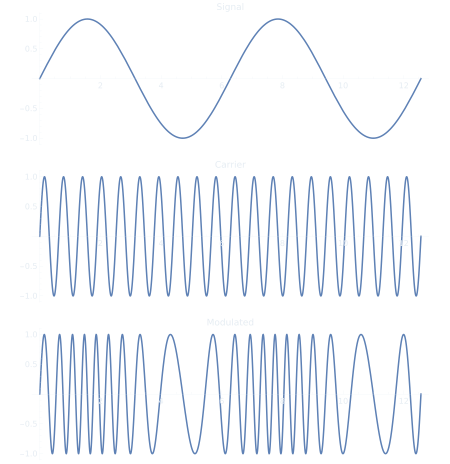
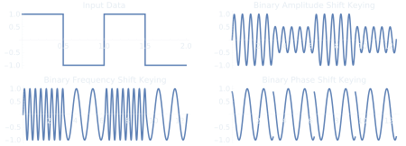
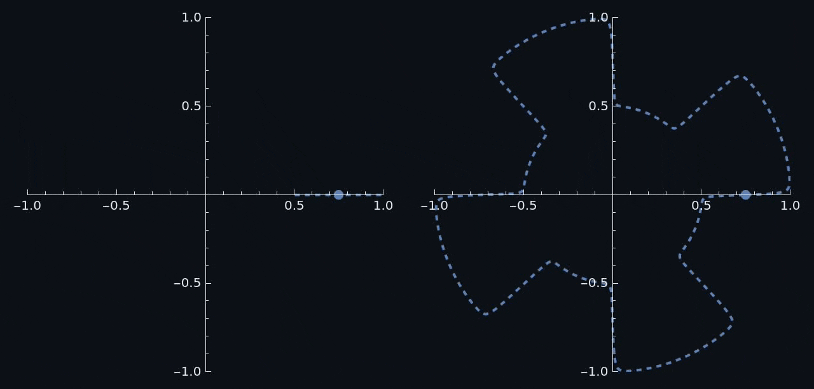
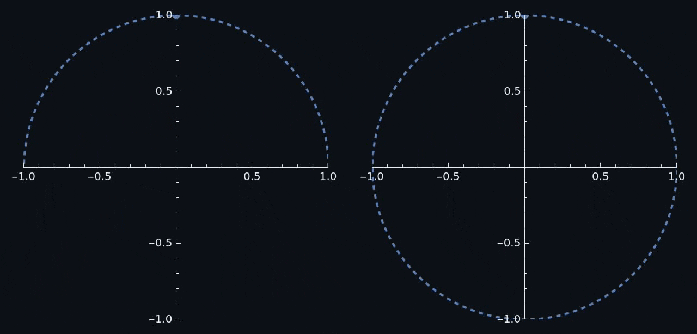

<h1 title>Data Modulation</h1>

## Software Defined Radio Workshop

---

# Basic Data Modulation

- There are three parameters you can change on a sine wave: amplitude, frequency, and phase shift
- As such there are three main type of modulation schemes
  - Amplitude Modulation (AM)
  - Frequency Modulation (FM)
  - Phase Modulation (PM)
- More complex modulation schemes can be a combination of these

---

# <!-- fit --> Analog Modulation

I'm only covering AM and FM here because they are a lot more common than PM.

<!--
I don't think phase modulation was historically used in radio transmission. At least not commonly.

It was used for other applications like analog synthesizers.
-->

---

## Amplitude Modulation (AM)

- Simplest analog modulation scheme
- Popularized in the 1900s for wirelessly transmitting morse code and later audio (AM Radio)
- Very susceptible to noise and interference

<!--
Due to the high susceptibility to noise / interference *much* higher broadcast power is needed to overcome interference
-->

---

### Amplitude Modulation Index

- To reduce distortion, the modulation percent can be decreased
- Modulation over 100% is called over-modulation

</img>

---

## Frequency Modulation (FM)

- The instantaneous frequency of the carrier is modulated by the signal
- Much less susceptible to noise and interference (Thats why we still use FM radio)

---

### Frequency Modulation Bandwidth

- The bandwidth of a FM signal is the difference between the lowest and highest instantaneous frequencies
- Large bandwidths give higher quality audio, but use more radio spectrum

 

</img>

---

# <!-- fit --> Digital Modulation

Instead of just being referred to as modulations, digital schemes are called shift keyings.

---

# Binary Shift Keying

---

# Binary Amplitude Shift Keying Constellation

---

# Binary Phase Shift Keying Constellation

