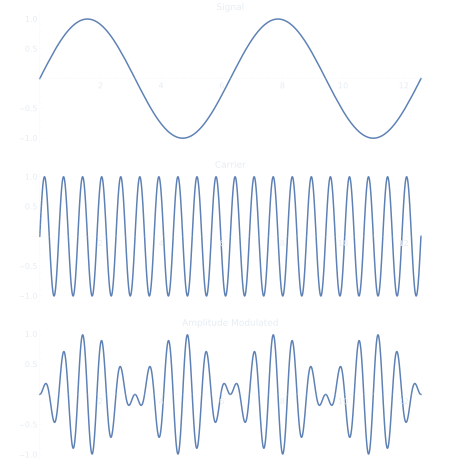
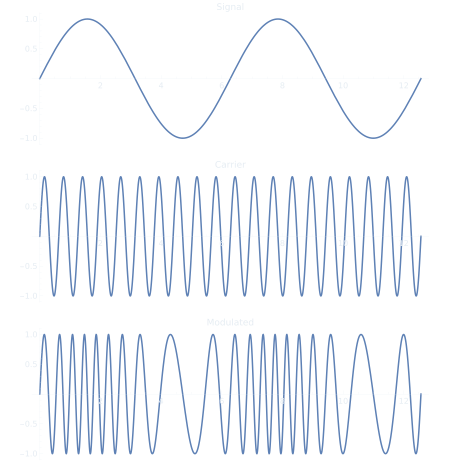

<h1 title>Software Defined Radio and Digital Signal Processing Workshop</h1>

## Connor Slade

---

# Basic Data Modulation

- There are three parameters you can change on a sine wave, amplitude, frequency, and phase shift
- As such there are three main type of modulation schemes
  - Amplitude Modulation (AM)
  - Frequency Modulation (FM)
  - Phase Modulation (PM)
- More complex modulation schemes can be a combination of these

---

# <!-- fit --> Analog Modulation

---

## Amplitude Modulation (AM)

- Simplest analog modulation scheme
- Became popular in the 1900s for wirelessly transmitting morse code and later audio (AM Radio)

---

## Amplitude Modulation with IQ Samples

- An amplitude modulated signal can be represented as $A(t)*e^{i2\pi{}f_ct}$
  - $A(t)$ is the signal to broadcast
  - $f_c$ is the carrier frequency

---

## Frequency Modulation (FM)

---

## Other Analog Modulations

---

# <!-- fit --> Digital Modulation

Instead of just being referred to as modulations, digital schemes are called shift keyings.

---

## Amplitude Shift Keying (ASK)

---

## Frequency Shift Keying (FSK)

---

## Phase Shift Keying (PSK)
