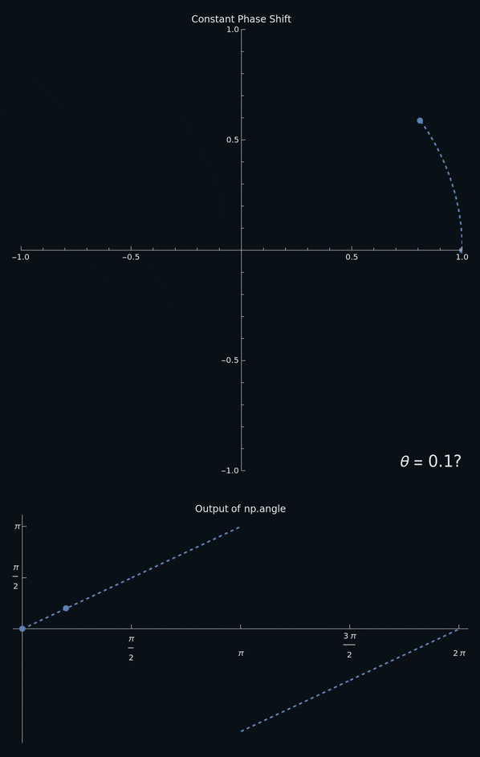

<h1 title>FM Radio Project</h1>

## SDR and DSP Workshop

---

# Project Summary

We will be writing a Python program that records a FM radio station from the SDR for a few seconds then outputs a `.wav` file containing the demodulated audio.

---

# Introduction to `pyrtlsdr`

- PyRTL-SDR is used to initialize the SDR at startup then read samples
- The first ~2000 samples should be ignored

```python
sdr = RtlSdr() # Connect to RTL-SDR device
sdr.sample_rate = 250_000 # 250 kHz
sdr.center_freq = 200_000_000 # 200 MHz
sdr.gain = 'auto'
```

```python
# Ignore first 2048 samples
sdr.read_samples(2048)

while True:
  # Read 1024 IQ samples from the device
  samples = sdr.read_samples(1024)
```

---

# Introduction to `numpy`

- Each chunk of samples needs to be processed quickly or the program won't run in real time (Python on its own is not fast enough!)
- Numpy allows efficiently performing operations on large datasets

<br>

```python
array = np.array([1, 2, 3]) # Convert a Python List to a Numpy Array
```

---

# Array Operations with `numpy`

- Basic operations like `+`, `-`, `*`, and `/` can be performed *element-wise* on same sized arrays
- Many mathematical functions and constants are available like `np.angle`, `np.mean`, and `np.pi`

<br>

```python
a = np.array([1., 2., 3.])
b = np.array([4., 5., 6.])

a + b # [5., 7., 9.]
np.mean(a) # 2.0
```

---

# Frequency Modulated Audio

- Remember that FM radio modulates the instantaneous frequency of a carrier wave with an audio signal
- Therefore to demodulate it, we need to determine the frequency at each point
  - This is the same as the change in phase between samples!

---

# Avoiding DC Offset

- Because of the physical implementation of most SDRs, there will be a frequency spike at the center frequency
  - This ends up messing up FM demodulation a lot,
- We can avoid it by shifting our center frequency up a bit (100 kHz for example) then shifting our samples the other way in software

---

# Ignoring Other Stations

<div two-column>
<div>

- Before we get to demodulating any signals, we should first isolate the station we actually want to listen to
- By setting the `center_freq`, we shift the center of our signal down to $0\text{ Hz}$
  - This means we can use a *low pass filter*

</div>
<div style="width:90%;margin-left:10px">
</img>
</div>
</div>

---

# Low Pass Filters

<div style="z-index:10;position:relative">

- Only allows frequencies lower than a defined *cutoff frequency* to pass through
- Symmetric around 0 Hz

</div>

<div center style="transform:translateY(-60px)">
</img>
</div>

---

# Scipy Low Pass Filter

- Scipy is a library that contains many algorithms for scientific computing, including signal processing
- The `signal.butter` function prepares the filter and returns the filter coefficients to be passed to `signal.lfilter` with the samples

```python
b, a = signal.butter(order, cutoff, "low", fs=sample_rate)
samples = signal.lfilter(b, a, samples)
```

- order &mdash; An integer that determines the slope of the falloff (5 is good)
- cutoff &mdash; The cutoff frequency in Hz (requires fs)

---

# Pairing Up Samples (Windowing)

- Because `numpy` works on arrays, not individual values, we need a way to compare neighboring samples
- We can take two slices, removing one element from the start of one and the end of the other

<br/>
<div style="display:grid;grid-template-columns: 1fr 2fr;">
<div>

|`[:-1]`|A|B|C|D|
|-:|-|-|-|-|
|`[1:]`|B|C|D|E|

</div>
<div style="align-self: center">

```python
a, b = samples[:-1], samples[1:]
```

</div>
</div>

---

<div two-column>
<div>

# Angle between Samples

- We can't just use `np.angle(b) - np.angle(a)` because of the discontinuity at $\pi$
- The solution is to rotate $b$ by $-a$, then measure the angle of $b$
  - Dividing rotates the opposite way as multiplication

<br>
<div center>

`np.angle(b / a)`

</div>
</div>
<div>
</img>
</div>
</div>

---

# Putting It all Together

```python
def process_samples(samples):
    t = np.arange(len(samples)) / sdr.sample_rate
    samples *= np.exp(2j * np.pi * OFFSET * t)

    b, a = signal.butter(5, BANDWIDTH, "low", fs=sdr.sample_rate)
    samples = signal.lfilter(b, a, samples)

    a, b = samples[:-1], samples[1:]
    angular_frequency = np.angle(b / a)

    return angular_frequency * GAIN
```
