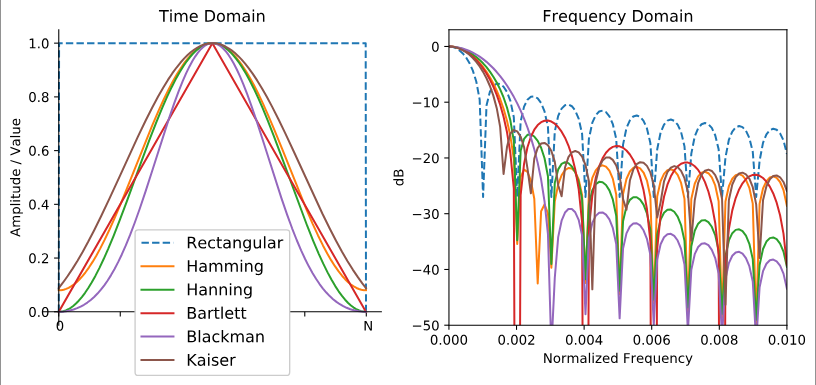

<h1 title>Spectrogram Project</h1>

## Software Defined Radio Workshop

---

# The Fourier Transform

<div two-column>
<div>

- When working with discrete-time signals, we use a discrete Fourier transform (DFT)

- A fast Fourier transform (FFT) is an efficient algorithm for computing the DFT

- Complex values are used with FTs (instead of just real values) to represent the phase shifts

</div>
<div style="width: 60%;margin-left: 30px;">

$$
\hat{f}(\xi)=\int^{\infin}_{-\infin}f(x)e^{-i2\pi\xi x}dx\\[3mm]
\Downarrow\\[3mm]
X_k=\sum_{n=0}^{N-1}x_ne^{-i2\pi{}\frac{k}{N}n}
$$

</div>
</div>

<!--
Because of how the FFT is implemented, it's best to use some power of 2 number of samples as input.

$$
\hat{f}(\xi)=\int^{\infin}_{-\infin}f(x)e^{-i2\pi\xi x}dx
$$

e^ix = cos(x) + i*sin(x)
-->

---

# DFT Properties

- The size of the frequency domain output is the same as time domain input
  - More samples results in a higher resolution in the frequency domain
  - Each bin corresponds to $f_s/N\text{ Hz}$
- Increasing the sample rate gives us a greater frequency range in the output
  - The output range is $-f_s/2$ to $f_s/2$
  - This makes sense if you think back to the Nyquist Sampling Theorem

<br />

> $f_s$ is the sample rate.

<!--
When givin a completely real time-domain input, the frequency-domain output's positive and negative segments will be identical in magnitude,
the negative frequencies will be complex conjugates of the positive frequency components.
-->

---

# Negative Frequency???

<div two-column>
<div>

- Negative frequency dose not exist physically, it's just a mathematical construct
- Its effectively just a frequency relative to our defined center frequency
- If we tune to 100 MHz with a sample rate of 10 MHz, we will view the spectrum from 95 MHz to 105 MHz

</div>
<div style="width: 70%;margin-left: 30px;">


</div>
</div>

---

# Windowing

- FFTs assume that the time-domain input signals are periodic, meaning the last sample connects back to the first
- Sharp jumps between samples cause lots of unwanted frequency artifacts
- To avoid jumps, we use *windowing functions* to taper our signal to zero at the ends

<div center>

</div>

---

# FFT in Python

<div two-column>
<div style="width: 49.5%;">

```python
from rtlsdr import RtlSdr
import numpy as np

sdr = RtlSdr()
sdr.sample_rate = 2.048e6
sdr.center_freq = 99.1e6

# Discard the first ~2k samples as
# they don't contain useful data.
# Just a quirk of the hardware...
sdr.read_samples(2048)
```

</div>
<div style="width: 49.5%;">

```python
# Read in some samples (they are complex,
# we will get to why in the next section)
samples = sdr.read_samples(FFT_SIZE)
              * np.hamming(FFT_SIZE)

# Use numpy to perform a FFT, transforming
# our signal into the frequency domain.
fft = np.fft.fftshift(np.fft.fft(samples))

# Get the magnitude of each frequency
# component, ignoring phase shifts.
freq = np.abs(fft)
```

</div>
</div>

<!--
Note that the discarding of ~2048 samples has been omitted from this example.

What is the frequency range and bin width of the freq array:

- center_freq - f_s/2 = 98.08
- center_freq + f_s/2 = 100.12

- f_s/fft_size = 4000 Hz
-->

---

# What is `np.fft.fftshift`?

- Due to *math reasons*, the output of a Fourier Transform starts with the DC component, the positive frequencies, then the negative ones
- We usually want negative frequencies on the left, DC in the middle, and positive frequencies on the right
- This function just shifts the array around into the desired format

<div center>


</div>

---

# Spectrograms

<div two-column>
<div>

- A spectrogram is a plot that shows a signal's frequency over time
- This is achieved by splitting the incoming samples into chunks and stacking their frequency domain representations
- A color map is used to display the magnitude of each frequency

</div>
<div style="width: 110%">


</div>
</div>

<!--
Also known as a waterfall plot
-->

---

# Try It Yourself

<div two-column>
<div>

- In the folder you downloaded, open SDR++ and tune to 100 MHz, here you can see the signal in real time and decode it using WFM mode

</div>
<div style="width: 100%">


</div>
</div>

---

# Resources

If you want more information on the topics covered in this lesson, check out these resources:

- [PySDR &mdash; Frequency Domain](https://pysdr.org/content/frequency_domain.html)
- [Veritasium &mdash; The Fast Fourier Transform Algorithm](https://www.youtube.com/watch?v=nmgFG7PUHfo)
