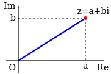

# Math Review

(also some new things probably)
This stuff will come up in the next few lessons.

---

# Complex Numbers

<div two-column>
<div>

- The complex numbers are a number system extending the real numbers
- They are expressed in the form $a+bi$, where $i$ is the imaginary unit
- A complex number can be represented as a point in a 2D coordinate system known as the *complex plane*

</div>
<div style="width: 80%;margin-left: 20px;">
</img>
</div>
</div>

<!--
We will only be using the rectangular form.
-->

---

# Complex Operations

Complex numbers can be added, subtracted, multiplied, and divided as you would expect, but there are also some more intreating operations:

- The complex conjugate of a number $a+bi$ is defined as $a-bi$
- The absolute value of a complex number is it's magnitude, $\sqrt{a^2 + b^2}$
- The argument or phase of a complex number is the angle with the positive real axis, $\text{arctan2}(b, a)$

---

# Euler's formula

<div two-column>
<div style="width: 65%">

- Establishes the relationship between trig functions and the complex exponential function
- Provides a compact notation for defining *complex sinusoids* (like the one to the right)

<br />

<div center>

$$
\boxed{e^{ix} = \cos(x)+i\sin(x)}
$$

</div>

</div>
<div style="width: 35%;margin-left: 20px;">

</div>
</div>

---

# Complex Numbers in Python

<div two-column>
<div>

- Python actually has native support for complex numbers, but the imaginary unit is $j$ not $i$
- We will make use of the mathematical functions from numpy as they work on singular numbers and arrays

</div>
<div style="width: 100%;margin-left: 20px;">

```python
import numpy as np

a = 3 + 5j

assert a.real == 3
assert a.imag == 5

conjugate = np.conjugate(a)
magnitude = np.abs(a)
phase = np.angle(a)

t, freq = 0, 100
shift = np.exp(2j * np.pi * freq * t)
```

</div>
</div>

<!--
j is used over i because in electrical engineering i is used for current
-->

---

# What is an Audio Signal (Delete?)

- Sound travels through air rather than propagating on its own like radio waves
- We can also represent audio as a sequence of samples
