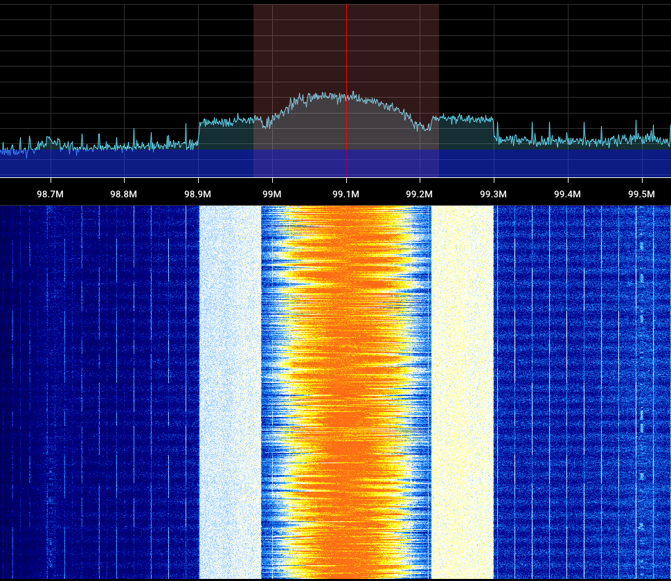
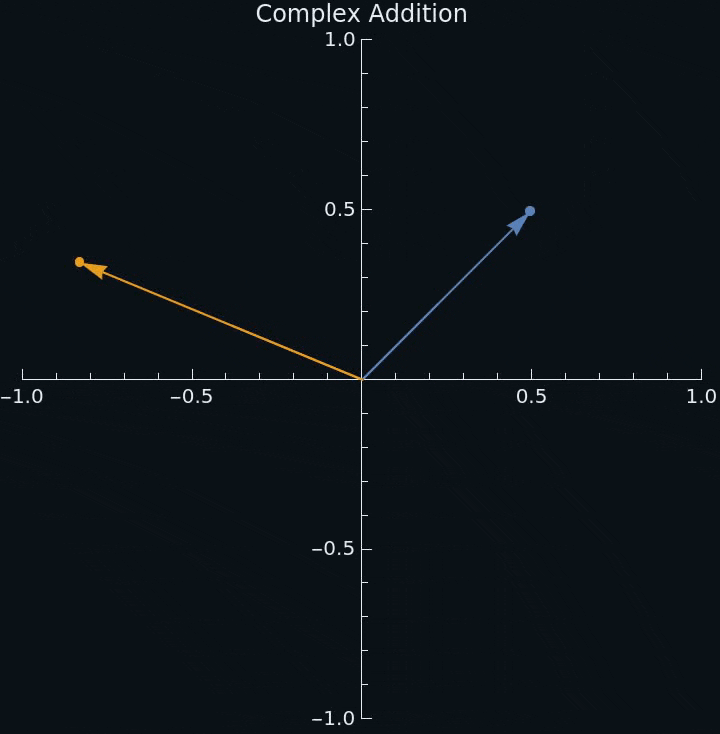
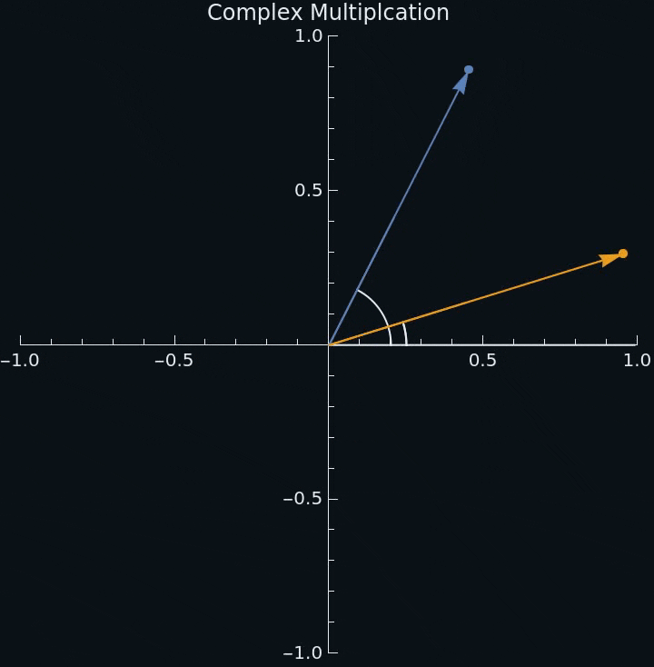

# Math Review

(also some new things probably)
This stuff will come up in the next few lessons.

---

# Complex Numbers

<div two-column>
<div>

- The complex numbers are a number system extending the real numbers
- They are expressed in the form $a+bi$, where $i$ is the imaginary unit
- A complex number can be represented as a point in a 2D coordinate system known as the *complex plane*

</div>
<div style="width: 80%;margin-left: 20px;">
</img>
</div>
</div>

<!--
We will only be using the rectangular form.
-->

---

# Complex Operations

Complex numbers can be added, subtracted, multiplied, and divided as you would expect, but there are also some more intreating operations:

- The complex conjugate of a number $a+bi$ is defined as $a-bi$
- The absolute value of a complex number is it's magnitude, $\sqrt{a^2 + b^2}$
- The argument or phase of a complex number is the angle with the positive real axis, $\text{arctan2}(b, a)$

---

# Euler's formula

<div two-column>
<div style="width: 65%">

- Establishes the relationship between trig functions and the complex exponential function
- Provides a compact notation for defining *complex sinusoids* (like the one to the right)

<br />

<div center>

$$
\boxed{e^{ix} = \cos(x)+i\sin(x)}
$$

</div>

</div>
<div style="width: 35%;margin-left: 20px;">

</div>
</div>

---

# Complex Numbers in Python

<div two-column>
<div>

- Python actually has native support for complex numbers, but the imaginary unit is $j$ not $i$
- We will make use of the mathematical functions from numpy as they work on singular numbers and arrays

</div>
<div style="width: 100%;margin-left: 20px;">

```python
import numpy as np

a = 3 + 5j

assert a.real == 3
assert a.imag == 5

conjugate = np.conjugate(a)
magnitude = np.abs(a)
phase = np.angle(a)

t, freq = 0, 100
shift = np.exp(2j * np.pi * freq * t)
```

</div>
</div>

<!--
j is used over i because in electrical engineering i is used for current
-->

---

# What is an Audio Signal (Delete?)

- Sound travels through air rather than propagating on its own like radio waves
- We can also represent audio as a sequence of samples

---

# Try It Yourself

<div two-column>
<div>

- In the folder you downloaded, open SDR++ and tune to 100 MHz, here you can see the signal in real time and decode it using WFM mode

</div>
<div style="width: 100%">



</div>
</div>

---

# Time-Frequency Properties

<div two-column>
<div>

- Time-Frequency Properties or 'Fourier properties' tell us how the frequency domain signal is affected by certain modifications to time domain signal
- There are more properties than what is covered here

</div>
<div style="width: 70%;">

1. Linearity
1. Frequency Shift
1. Scaling in Time

</div>
</div>

<!--
Additional properties:

- Convolution in Time Property
- Convolution in Frequency Property
-->

---

# Time-Frequency Properties: Linearity

- If we add two signals in the time domain, the two frequency domain signals will also be added together.
- If either of the time domain signals are scaled, the frequency domain signal will also scaled by the same amount.

<br />

$$
\boxed{ax(t)+bx(t) \leftrightarrow aX(f)+bY(f)}
$$

---

# Time-Frequency Properties: Frequency Shift

- By multiplying a time domain signal by a sine wave at frequency $f_0$, we shift it by $f_0$ in the frequency domain
- This is how the tuner in the RTL-SDR is able to change the center frequency, it also allows us to focus in on specific parts of the spectrum in software

<br />

$$
\boxed{e^{i2\pi{}f_0t}x(t) \leftrightarrow X(f-f_0)}
$$

---

# Time-Frequency Properties: Scaling in Time

- Scaling in the time domain causes an inverse scaling in the frequency domain
- This means that if we want to transfer data at a faster rate, we have to use physically more of the bandwidth

<br />

$$
\boxed{x(at) \leftrightarrow X(\frac{f}{a})\times \frac{1}{\lvert a \rvert}}
$$

---

# The Fourier Transform

<div two-column>
<div>

- Operation that converts a time-domain signal to the frequency-domain
- When working with discrete-time signals, we use a discrete Fourier transform (DFT)
- A fast Fourier transform (FFT) is an efficient algorithm for computing the DFT
- Complex values are used with FTs (instead of just real values) to represent the phase shifts

</div>
<div style="width: 60%;margin-left: 30px;">

$$
\hat{f}(\xi)=\int^{\infin}_{-\infin}f(x)e^{-i2\pi\xi x}dx\\[3mm]
\Downarrow\\[3mm]
X_k=\sum_{n=0}^{N-1}x_ne^{-i2\pi{}\frac{k}{N}n}
$$

</div>
</div>

<!--
Because of how the FFT is implemented, it's best to use some power of 2 number of samples as input.

$$
\hat{f}(\xi)=\int^{\infin}_{-\infin}f(x)e^{-i2\pi\xi x}dx
$$

e^ix = cos(x) + i*sin(x)
-->

---

# Introduction to `numpy`

- Each chunk of samples needs to be processed quickly or the program won't run in real time (Python on its own is not fast enough!)
- Numpy allows efficiently performing operations on large datasets
- The PyRTL-SDR method `read_samples` actually returns a numpy array

<br>

```python
array = np.array([1, 2, 3]) # Convert a Python List to a Numpy Array
```

---

# Array Operations with `numpy`

- Basic operations like `+`, `-`, `*`, and `/` can be performed *element-wise* on same sized arrays
- Many mathematical functions are available like `np.hanning`, `np.fft.fft`, `np.fft.fftshift`, `np.abs`

<br>

```python
a = np.array([1., 2., 3.])
b = np.array([4., 5., 6.])

a + b # [5., 7., 9.]
np.mean(a) # 2.0
```
---

---

# IQ Samples as Complex Numbers

- IQ samples are often represented a *complex numbers*
  - The in-phase component is real and the quadrature component is imaginary ($I+Qi$)
- Complex operations
  - Absolute value is its magnitude (distance from the origin)
  - Argument is the angle it makes with the positive real axis $[-\pi{},\pi{}]$
  - Addition adds the real and imaginary components
  - Multiplication adds the angles and multiplies the lengths

---

## Complex Addition and Multiplication

<div center>
<div two-column-grid style="width: 90%;gap:60px">
<div></img></div>
<div></img></div>
</div>
</div>

